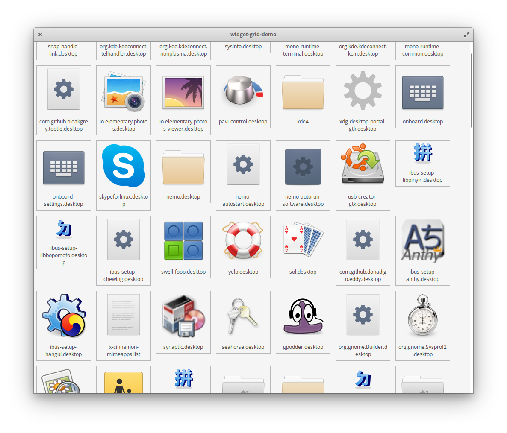

# widget-grid

Fast scrollable, zoomable, resizable display of widgets in a grid.

* Uses a limited number of recycled widgets regardless of the size of the model.
* Potentially suitable as a substitute for Gtk.IconView for some purposes.
* Demo program uses pantheon-file-core as a source of zoomable file objects with icons for display.



## Building, Testing, and Installation

You'll need the following packages and their dependencies:
* meson
* valac
* libgranite-dev >= 5.2.0
* libgtk-3-dev
* pantheon-files-core-dev

Run `meson build` to configure the build environment. Change to the build directory and run `ninja` to build

```bash
meson build --prefix=/usr
cd build
ninja
```

To try out the demo run `./widget-grid-demo` from the build directory.

The demo displays the contents of the applications directory duplicated 100 times (about 12,000 items in model). The files are displayed as an icon and a name similar to a file manager.

The view can be scrolled with the scrollbar or using mouse or touchpad as usual.

The view can be zoomed using `<Ctrl>Scroll`.

The view can be resized and the items will reflow rapidly.

The speed of these operations is essentially unaffected by the size of the model once loaded (larger models will take longer to load).

The appearance and behaviour of the view is governed the widgets not the view, which simply lays them out.

Any widget customized to implement WidgetGrid.ItemInterface can be used (provided from a suitable factory).

The model holds variable data for the widgets.  The widgets are re-used and updated as required so only enough widgets to fill the view (plus two extra rows) are needed, increasing speed and reducing memory requirements.


